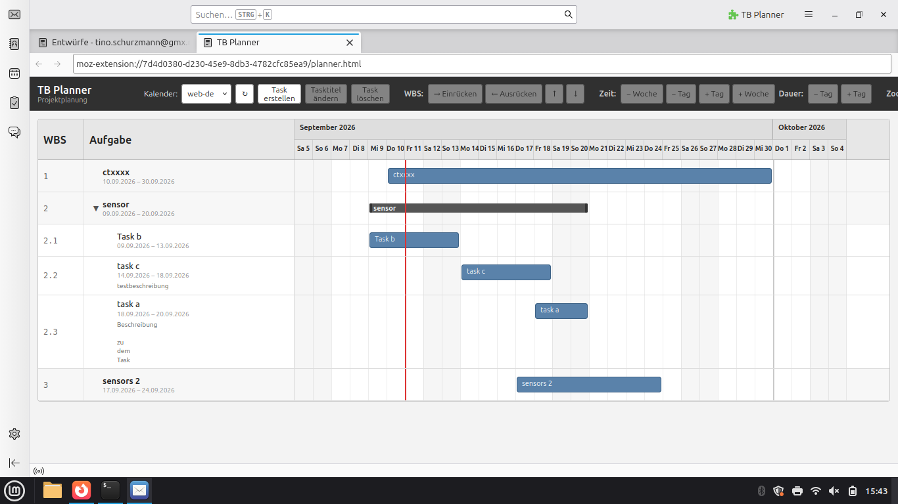

# TB Planner

TB Planner ist ein Thunderbird-Addon zur visuellen Projektplanung in Form einer Gantt-ähnlichen Taskliste.

Die Aufgaben werden als **VTODOs in Thunderbird-Kalendern** gespeichert und können im TB Planner hierarchisch als WBS-Struktur organisiert werden.

## Screenshot

## Funktionen

### Taskplanung

- Gantt-ähnliche Darstellung von Tasks
- Startdatum und Enddatum
- Taskdauer
- Hierarchische Strukturierung
- WBS-Nummerierung
- Tasks ein- und ausrücken
- Tasks innerhalb der Hierarchie verschieben
- Deutliche Kennzeichnung des ausgewählten Tasks

### Taskverwaltung

- Task erstellen
- Tasktitel ändern
- Task löschen
- Startdatum festlegen
- Taskdauer festlegen
- Startdatum verschieben
- Dauer verändern
- Taskbeschreibung speichern
- Mehrzeilige Taskbeschreibungen
- Beschreibung direkt unter dem Task anzeigen

### Thunderbird-Integration

Die Tasks werden als **VTODOs in Thunderbird-Kalendern** gespeichert.

Zusätzliche TB-Planner-Informationen werden direkt am VTODO gespeichert. Dazu gehören insbesondere:

- WBS-Information
- Parent-Task
- Reihenfolge innerhalb der Hierarchie

Dadurch kann die Projektstruktur beim erneuten Laden aus dem Kalender wiederhergestellt werden.

## Taskbeschreibungen

Jeder Task kann neben dem Titel eine ausführliche Beschreibung enthalten.

Die Beschreibung wird direkt unterhalb des Tasktitels angezeigt und ist damit auch Bestandteil der sichtbaren Projektübersicht.

Mehrzeilige Beschreibungen werden unterstützt.

## WBS

Die Tasks können hierarchisch organisiert werden.

Beispiel:

    1       Projekt
    2       Sensorik
    2.1       Sensor auswählen
    2.2       Sensor beschaffen
    2.3       Sensor installieren
    2.4       Sensor testen
    3       Dokumentation

Die WBS-Nummerierung wird aus der aktuellen Hierarchie erzeugt.

## Darstellung

Die Oberfläche besteht im Wesentlichen aus zwei Bereichen:

- **Taskliste:** WBS, Tasktitel, Beschreibung und Datumsangaben
- **Gantt-Bereich:** zeitliche Darstellung der Tasks

Die rote Linie kennzeichnet den aktuellen Tag.

## Datenhaltung

TB Planner verwendet Thunderbird-Kalender als Datenspeicher.

Die eigentlichen Tasks bleiben dabei normale VTODOs. Zusätzliche Eigenschaften werden verwendet, um die für TB Planner benötigte Projektstruktur zu speichern.

## Entwicklungsstand

TB Planner befindet sich derzeit in aktiver Entwicklung.

Die grundlegende Taskverwaltung, Gantt-Darstellung und Thunderbird-Kalenderintegration sind bereits implementiert.

Weitere Funktionen und Verbesserungen der Benutzeroberfläche werden schrittweise ergänzt.

## Installation und Entwicklung

Das Projekt ist als Thunderbird WebExtension aufgebaut.

Das Repository enthält unter anderem:

    planner.html        Benutzeroberfläche
    planner.js          Anwendungslogik
    planner.css         Gestaltung
    experiments/        Thunderbird-Kalenderintegration
    src/                Extension-Komponenten
    build-xpi.sh        Build-Skript
    git_sync.sh         Git-Synchronisation

## Build

Das Add-on kann mit dem vorhandenen Build-Skript gebaut werden:

    ./build-xpi.sh

Die erzeugte XPI-Datei kann anschließend in Thunderbird als Add-on installiert werden.

## Git-Synchronisation

Für die Synchronisation des aktuellen lokalen Entwicklungsstandes mit GitHub steht `git_sync.sh` zur Verfügung:

    ./git_sync.sh

Das Skript übernimmt die lokalen Änderungen in einen Git-Commit und pusht den aktuellen Stand nach GitHub.

## Lizenz

**Frei wie Freibier.**

Copyright (c) 2026 Tino Schurzmann.

Dieses Projekt steht unter der MIT License.

Du darfst die Software frei verwenden, kopieren, verändern und
weitergeben – auch für kommerzielle Zwecke.
